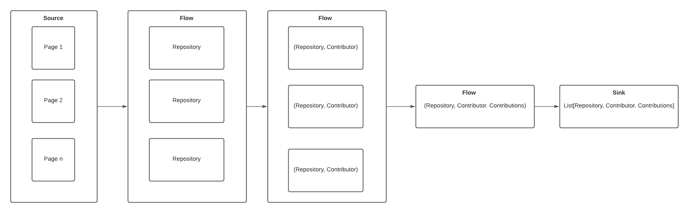

# Github Challenge

GitHub portal is centered around organizations and repositories. Each organization has many repositories and each
repository has many contributors. Your goal is to create an endpoint that given the name of the organization will return
a list of contributors sorted by the number of contributions. The endpoint should:

- use GitHub REST API v3 (https://developer.github.com/v3/)
- return a list sorted by the number of contributions made by the developer to all repositories for the given
  organization.
- respond to a GET request at port 8080 and address /org/{org_name}/contributors
- respond with JSON, which should be a list of contributors in the following format: { “name”: <contributor_login>,
  “contributions”: <no_of_contributions> }
- handle GitHub’s API rate limit restriction using a token that can be set as an environment variable of name GH_TOKEN
- friendly hint: GitHub API returns paginated responses. You should take it into account if you want the result to be
  accurate for larger organizations.

Judging criteria (top the most important)

- finished working sample (usable API, clear instructions on how to run and use) code quality (idiomatic Scala,
  functional programming preferred)
- design quality (proper abstractions)
- tests
- taking advantage of the framework in use
- HTTP protocol usage (response codes, headers, caching, etc.)
- performance
- documented code (where it’s relevant)

## Solution

The project is organized following the clean architecture proposed by Robert C. Martin. However, I have not considered
for this project the use of UseCases, since the project is simple with no business rules to make sense adding another
layer of abstraction.

The SBT plugins in turn:

- sbt scoverage
- sbt dotenv
- sbt native packager

To exploit Akka and ZIO possibilities, the solution has been developed using the two stacks. The overall organization of
the project is the following.

- `adapters`. Responsible for implementing adapters, such as json serialization using Circle;
- `core`. Responsible for defining the services, entities and core parts of the project;
- `akka-project`. Implementation using Akka toolkit;
- `zio-project`. Implementation using ZIO and http4s.

### Akka Project

The Scala libraries used to in **Akka Project****:

- Cats
- Akka Http
- Akka Http Caching
- Circle Json
- Scala EHCache
- Logback
- Scalatest

To solve the ranking problem presented in the challenge, we can take advantage of a streaming-based approach in a way we
do data transformation to retrieve a list of tuples `(contributor, contributions)` to get the final aggregation for the
organization. The streaming approach gives us tools to control the parallelism, number of requests to Github API, and
how fast we would like to go, by setting the throughput rate.

Figure 1 presents the general overview of the streaming flow. The source is made of page numbers, we can compute based
on the number of repositories, each page number produces a list of repositories. Each list of repositories is flattened,
so we turn each repository into a list of contributors with their contributions. Then, we get a flow containing
tuples `(repository, contributor, contributions)` to finally materialize the streaming into a list of those tuples.

In the end, we can just aggregate the number of contributions by the contributor identifier. This implementation
is `StreamingRankAlgorithm`. A naive implementation was also done in `NaiveRankAlgorithm` to compare the two approaches.



**Figure 1.** An overview of the streaming based approach.

## ZIO Project

The Scala libraries used to in **Akka Project****:

- ZIO
- ZIO Stream
- sttp
- http4s
- Circle Json
- Logback
- Scalatest

Following the same idea from `Akka project`, here we take advantage of ZIO Stream to provide the implementation. In
general the approach is the same, but ZIO Stream offers interesting features that improved the implementation:

- `ZStream.paginateChunkM` and `ZStream.paginateM` help to paginate over repository and contributor pages in a simple
  and elegant way

> **NOTE**. Although using `throttleShape` to control data processing throughput, it seems not controlling as Akka Stream does in this case.
> I must understand better why this happened, maybe it is because ZIO Stream is pull-based streams, while Akka Stream is push-based streams.
> Therefore, in ZIO Stream, the next element will be asked only when the sink asks for it.

## Executing the project

Please, provide the access token in the file `.env` as shown below. All process described here uses that file to get the
access token to provide to the application as an environment variable.

```sh
# provide the access token to GitHub API
GH_TOKEN="...."
```

### Running with sbt

To run the project using sbt, we can simply execute the helper script `run-akka-with-sbt.sh` or `run-zio-with-sbt.sh` as
follows.

```bash
# run Akka Project
./run-akka-with-sbt.sh

# run ZIO Project
./run-zio-with-sbt.sh
```

This script will run the project and, if necessary, it will build the project before starting the application.

### Running with docker

To run the project using docker, we can simply execute the helper script `run-with-docker.sh` as follows. The manifest
`docker/docker-compose.yml` uses the images `igobrilhante/githubchallengezio:0.1.0`
and `igobrilhante/githubchallengeakka:0.1.0` already published into DockerHub.

> **NOTA**. Both http servers will run on docker, port `8080` for akka and `8081` for http4s with zio.

```bash
# run the script
./run-with-docker.sh
```

### Running some use cases

Once the http server is running, it will be listening on port `8080`.

```bash
AKKA_SERVER=http://localhost:8080
HTTP4S_SERVER=http://localhost:8081

SERVER=${HTTP4S_SERVER}
```

**CASE 1. Get an invalid organization**

```bash
curl ${SERVER}/org/igobrilhante/contributors
```

It should result in 404

```
HTTP/1.1 404 Not Found
Content-Length: 51
Content-Type: application/json
Date: Fri, 13 Aug 2021 13:14:57 GMT
Server: akka-http/10.2.6

{
    "message": "Organization 'igobrilhante' not found"
}
```

**CASE 2. Get ranked list for ScalaConsultants**

It might take some seconds to return the response.

```bash
curl ${SERVER}/org/ScalaConsultants/contributors
```

**CASE 3. Get ranked list for Github**

```bash
curl ${SERVER}/org/Github/contributors
```

> **NOTE**. The http server is configured with a timeout of 180 seconds. After this, the request is aborted.

## Tests

To run the tests, we can simply execute the following script. The tests use the file `.env` to get the access token.

```bash
./run-tests.sh
```

And open the coverage report:

```bash
open target/scala-2.13/scoverage-report/index.html
```